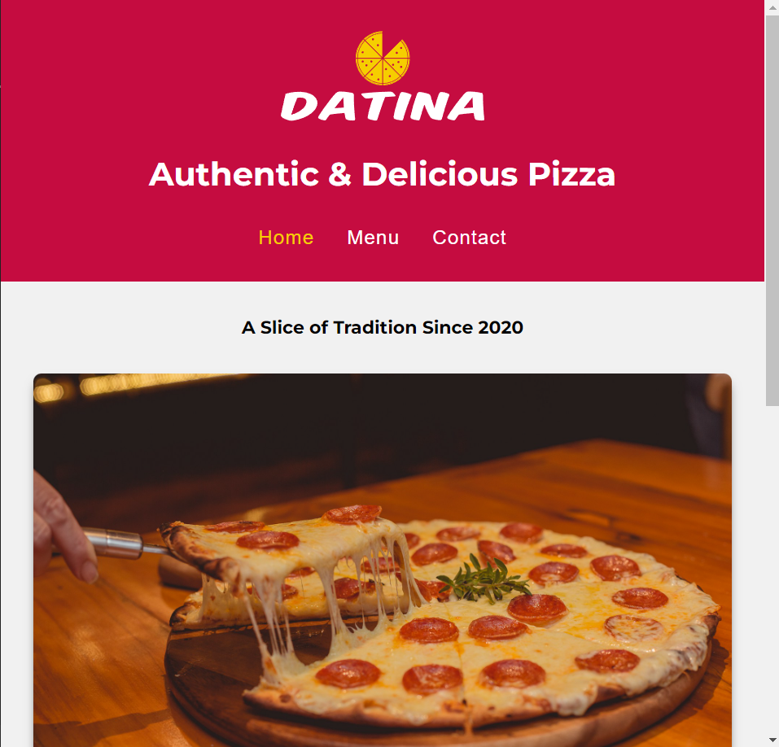

# Restaurant Page Datina SPA Mockup
### MVP v1.0

This webpage is a simple restaurant page mockup made to practice working with ES6 modules & Webpack to build a vanilla SPA.

## Technologies Used
- HTML
- CSS (Grid)
- JavaScript
- ES6 Modules
- Webpack

## What I learnt
- Working with Webpack.
- Working with ES6 Modules.

## Challenges and Future Improvements
- Perhaps I'll create a full fledged React version of this.
